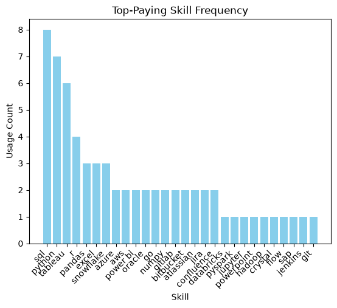

# Introduction
This project explores the highest paying data analyst jobs to identify the top in-demand skills to have for job-seekers pursuing data analysis.
SQL Queries: [project_sql folder](/project_sql/)
# Background
Looking to gain experience with SQL, I followed along with Luke Barousse's open-source SQL Data Analytics course (https://www.youtube.com/watch?v=7mz73uXD9DA&t=6102s). 
Through this project, I examined the top-paying remote data analysis jobs as well as the top in-demand skills across these job postings.
The data used throughout this project is from (https://lukebarousse.com/sql), which contains records of job titles, salaries, location, and required skills.
### The questions I sought to answer are as follows:
1. What are the top-paying data analyst jobs?
2. What skills are required for these top-paying jobs?
3. What skills are most in demand for data analysts?
4. Which skills are assocciated with higher salaries?
5. What are the most optimal skills to learn?

# Tools I Used
To answer these questions about the data analyst job market, I used the following key tools:
- **SQL:** To query the database, allowing me to clean, filter, and sort the data to pinpoint top-reoccuring skills and highest salary job postings.
- **PostgreSQL:** This database management system was at the core of handling the relational job posting data.
- **Visual Studio Code:** The code editor for running SQL queries and database management.
- **Git & Github:** For version control and sharing my workflow, ensuring changes are tracked and smooth collaboration .
# The Analysis
Each query for this project served to investigate a specific aspect of the data analyst job market. Here's my approach to tackling each question:

### 1. Top-Paying Data Analyst Jobs
I selected relevant columns such as the title, average salary, location, and schedule type to filter the highest-paying remote data analyst jobs. Then using the job identifier, I joined another table to match these jobs to the company name that posted them. This query supplied job-seekers with both insight into which roles to apply to as well as to which companies.

```sql
SELECT
    job_id,
    job_title,
    job_location,
    job_schedule_type,
    salary_year_avg,
    job_posted_date,
    name AS company_name
FROM   
    job_postings_fact
-- Get company names
LEFT JOIN company_dim on job_postings_fact.company_id = company_dim.company_id
WHERE
    job_title_short = 'Data Analyst' AND
    job_location = 'Anywhere' AND
    salary_year_avg IS NOT NULL
ORDER BY
    salary_year_avg DESC
LIMIT 10;
```
Breakdown of top-paying data analyst jobs in 2023:
- **Wide Salary Range:** The salary difference between the most well-paid job and the 10th most well-paid is about $450k indicating significant pay variation depending on company, experience level, and other factors as well as revealing great earning potential in the field.
- **Remote Opportunities:** Given the diversity of companies within these top 10 results, we see that there are many companies offering work-from-home options with substantial pay within the data analytics job field.
- **Job Specialty:** Unsurprisingly, the highest paying jobs within data analytics are supervisory and managemnet roles such as Director or Principal Data Analysts or more specialized roles such as risk management (ERM). Within the data analytics job market, we also see many diverse levels and sub-fields. 

### 2. Top-Paying Skills
I built on top of my query for the first question to create a common table expression (CTE) which contained the information on the top-paying, remote data analyst jobs. Then, I used innner joins to join [skill_job_dim.csv](../csv_files/skills_job_dim.csv), to match the job ID to skill ID and [skills_dim.csv](../csv_files/skills_dim.csv) to match the skill ID to skill name to identify the skills belonging to the top-paying jobs.

```sql
-- Create a CTE
WITH top_paying_jobs AS (
    SELECT
        job_id,
        job_title,
        salary_year_avg,
        name AS company_name
    FROM   
        job_postings_fact
    -- Get company names
    LEFT JOIN company_dim on job_postings_fact.company_id = company_dim.company_id
    WHERE
        job_title_short = 'Data Analyst' AND
        job_location = 'Anywhere' AND
        salary_year_avg IS NOT NULL
    ORDER BY
        salary_year_avg DESC
    LIMIT 10
)
SELECT 
    top_paying_jobs.*,
    skills_dim.skills
FROM top_paying_jobs
-- Join to match job id to skill id
INNER JOIN skills_job_dim
ON skills_job_dim.job_id = top_paying_jobs.job_id
-- Join to match skill id to skill name
INNER JOIN skills_dim
ON skills_job_dim.skill_id = skills_dim.skill_id
ORDER BY
    salary_year_avg DESC;
```
Breakdown of top-paying skills:
- **Skill Popularity:** Among the top 10 highest paying jobs, SQL and Python appear the most followed by Tableau. The bar graph below illustrates the demand for each skill among the highest-paying jobs.
- **Core Technical Stack:** Beyond the four most demanded skills, econdary data manipulation and management skills remain essential. This includes proficiency in libraries (Pandas), spreadsheets (Excel), and cloud data warehouses (Snowflake), underscoring the importance of a well-rounded skillset.
- **Specialized Skills:** Many skills appear only once or twice revealing that focused domain knowledge is a trend among these highest-paid positions.

<div align="center">
  
</div>

*Bar graph visualizing the skill frequency for the top-10 highest-paying data analyst jobs. This visulization was created using python (pandas and matplotlib)*

### 3. Top-Demanded Skills
I inner joined [skill_job_dim.csv](../csv_files/skills_job_dim.csv) and [skills_dim.csv](../csv_files/skills_dim.csv) to link jobs to their skills. I then used the COUNT function to count the sum total of jobs assocciated with each skill, grouping on skill. To identify the most frequently occuring skills, I sorted the data in descending order, identifying the most relevant skills for data analyst job-seekers to acquire and build upon.

```sql
SELECT
    skills,
    COUNT(skills_job_dim.job_id) AS demand_count
FROM job_postings_fact
INNER JOIN skills_job_dim on job_postings_fact.job_id = skills_job_dim.job_id
INNER JOIN skills_dim ON skills_job_dim.skill_id = skills_dim.skill_id
WHERE
    job_title_short = 'Data Analyst' AND
    job_work_from_home = TRUE
GROUP BY 
    skills
ORDER BY
    demand_count DESC
LIMIT 5;
```
Breakdown of top-demanded skills:
- **Programming Proficiency:** Two of the top five most demanded skills for data analysts are related to programming, highlighting the importance of coding skills—particularly in SQL and Python.
- **Spreadsheet Software:** Coming in second for the most in-demand skill is Excel, reflecting the importance of data management skills and showing that Excel is the most widely preferred application for doing so.
- **Visualization Tools:** Tableau and Power BI, which are both data visualization tools are the fourth and fifth highest-demanded skills, reinforcing the importance of not just being able to wrangle data but effectively illustrating why those numbers matter.

|Skills   | Demand Count |
|---------|--------------|
|SQL      | 7291         |
|Excel    | 4611         |
|Python   | 4330         |
|Tableau  | 3745         |
|Power BI | 2609         |

*Table containing the counts of the top-5 demanded skills among data analst job postings*

### 4. Top-Paying Skills
This question is similar to a mix of questions two and three, likewise, my approach to this was also a mix of my approach to those two. I joined tables to link essential data and for each skill, found the average yearly salaries of the jobs that required that skill. Examining these skills in descending order provides guidance to job-seekers on the most financially rewarding and promising skills to learn, regardless of job location.
```sql
SELECT
    skills_dim.skills AS skill,
    ROUND(AVG(salary_year_avg), 0) as avg_yearly_salary
FROM
    job_postings_fact
INNER JOIN skills_job_dim
ON job_postings_fact.job_id = skills_job_dim.job_id
INNER JOIN skills_dim
ON skills_job_dim.skill_id = skills_dim.skill_id
WHERE
    salary_year_avg IS NOT NULL AND
    job_title_short = 'Data Analyst' AND
    job_work_from_home = TRUE
GROUP BY
    skill
ORDER BY
    avg_yearly_salary DESC
LIMIT 25;
```
Breakdown of the top-paying skills:
- **Distributed Computing & Big Data:** PySpark holds the spot for highest-earning skill, revealing that being able to process and analyze large datasets is a common attribute among the highest-compensated roles.
- **Specialized Expertise:** Many of the highest skill-specific average salaries are tied to more focused technologies, like Couchbase for NoSQL databases as well as IBM Watson and DataRobot for machine learning. Compared to widely used analyst frameworks, these specific tools command higher pay due to talent scarcity.
- **Python Ecosystem:** Essential Python libraries like pandas, numpy, and scikit-learn dominate high-paying programming skills, underscoring that statistical programming tools are still core requirements in high-paying positions.

|Skill   | Average Salary ($) |
|---------|--------------|
|pyspark    | 208,172         |
|bitbucket    | 189,155        |
|couchbase|	160,515|
|watson	|160,515|
|datarobot	|155,486|
|gitlab	|154,500|
|swift	|153,750|
|jupyter	|152,777|
|pandas	|151,821|
|elasticsearch	|145,000|
|golang	|145,000|
|numpy	|143,513|
|databricks	|141,907|
|linux	|136,508|
|kubernetes	|132,500|
|atlassian	|131,162|
|twilio	|127,000|
|airflow	|126,103|
|scikit-learn	|125,781|
|jenkins	|125,436|


### 5. Optimal Skills
After joining the neccessay tables to relate the job to skills I found the number of jobs under each skill (labeled *demand_count*) and the overall average salary for the average anual salaries of those jobs per skill (labeled *avg_yearly_salary*). To find a balance between most sought after skills and skills required for the top-paying jobs, I the filted the data to skills that have a *demand_count* of at least 10. Finally, I ordered by the *avg_yearly_salary* followed by *demannd_count*—both in descending order. 

# What I Learned


# Conclusions